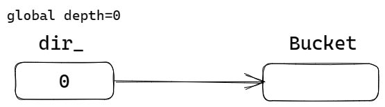
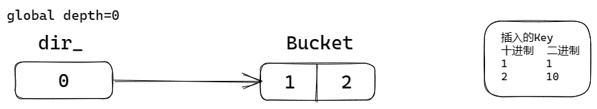
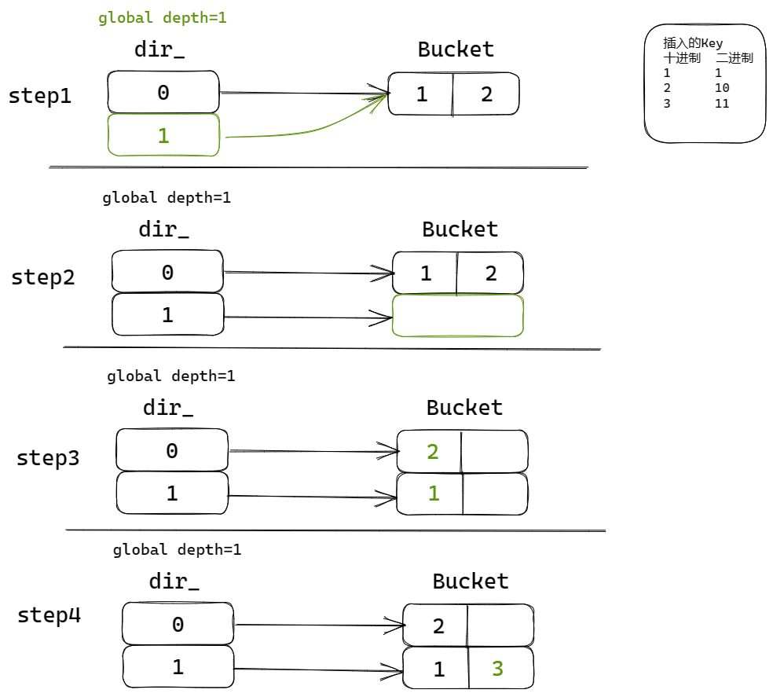
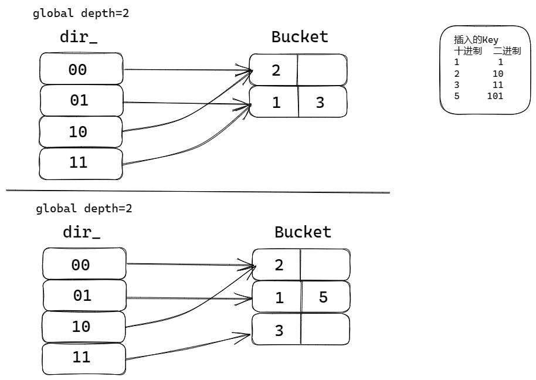
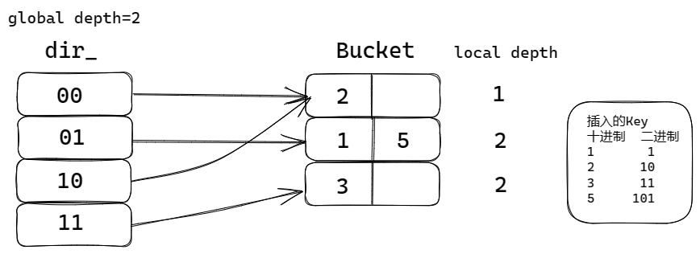
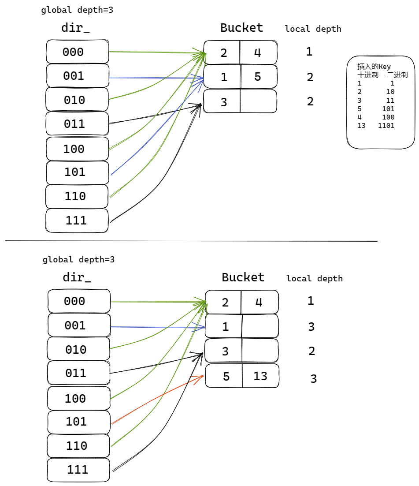
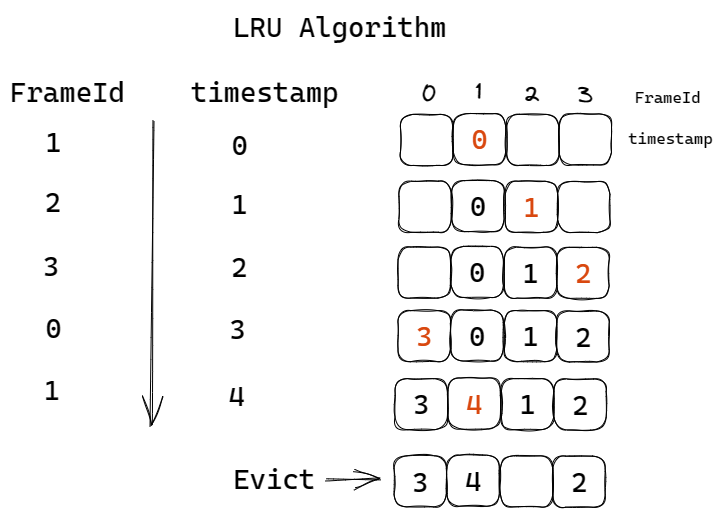
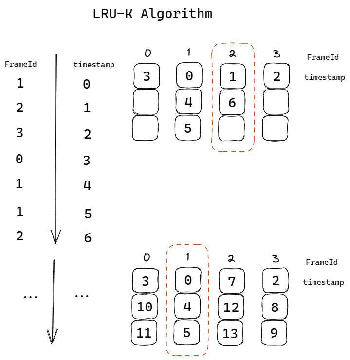
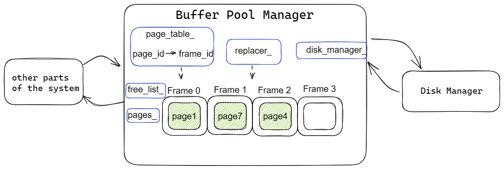

# Project#1 - Buffer Pool

#### CMU15-445 FALL 2022 Project#1 - Buffer Pool

题目要求： [Project #1 - Buffer Pool | CMU 15-445/645 :: Intro to Database Systems (Fall 2022)](https://15445.courses.cs.cmu.edu/fall2022/project1/) 

## Overview

项目想要实现一个面向磁盘的存储管理器` (disk-oriented storage manager) ` ，Project1需要实现存储管理器的缓冲池`(Buffer Pool)`。

- 缓冲池负责页面在内存和磁盘之间调换；
- 系统可以使用页号向缓冲池索取页面；
- 缓冲池的实现应该保证线程安全。

具体来说，Project 1需要实现三个组件：

- Extendible Hash Table
- LRU-K Replacement Policy
- Buffer Pool Manager Instance

## Task #1 - Extendible Hash Table

实现一个可扩展的哈希表，不能使用C++内置的哈希表（例如unordered_map）。

这里用到两个数据结构：

- `dir_` 即目录directory，这里存储哈希表中的Key值。
- `Bucket`存储哈希表中的Value值。且Bucket内有一链表List，约定大小为n，可以存储n对键值`<K，V>`

Extendible Hash Table的特点是：多个key值可以对应同一个Bucket，当Bucket到达容量上限时，对Bucket进行分裂。

接下来用例子来演示Extendible Hash Table的工作过程：

在键值对插入之前，需要使用Hash函数`IndexOf()`计算其索引值，这里设置变量`global depth`标记在二进制下取哈希值的低几位。

- k等于十进制数13，在二进制下为`1101B`，
- 在`global depth = 3`的情况下，我们取低三位，`IndexOf(k) = 101`。

初始时，`global depth = 0`，取低0位作为索引值，即`IndexOf(k) = 0`，只有一个Bucket。

这里我们假设Bucket的大小为2。

向表中插入键值对，这里为了方便，在Bucket中只展示Key的情况，省略Value的可视化部分。

因为`IndexOf(k) = 0`，前两个键值对均插入已有的Bucket中。

当我们继续插入键值对时，

- 对于Bucket：现有的Bucket已经满了，我们需要分裂出新的Bucket，

- 对于`dir_`：根据低0位索引插入的方法不足以满足我们的数据量，我们将`global depth + 1`
- 但是，当`global depth = 1`时，对于之前插入的<K, V>，`IndexOf(k)`会改变。例如，十进制1的二进制为1，低一位为1；十进制2的二进制为10，低一位为0。所以当Bucket分裂后，键值对需要重新分配。

1. `global depth + 1`，扩展`dir_`，并且新的指针指向原Bucket。
2. 原Bucket分裂出新的Bucket，将`dir_`指针指向新Bucket。
3. 将原Bucket中的键值对的Key重新`IndexOf()`，分配到对应的Bucket中。
4. 插入新键值对。

接下来我们插入的键值对中，key = 5，会出现如下操作：

由于我们在插入时关注key的二进制形式，所以`dir_`中的索引均使用二进制表示

这里我们发现 2所在的Bucket有两个箭头指向，分析`dir_`索引值，上述两个箭头其低1位相同，而且通过低1位，就可以将 2所在的Bucket与其他Bucket区别出来。这里就引入了`local depth`。

每一个Bucket有其自己的`local depth`，对它自己来讲，在`dir_`中可以通过低`local depth`位来索引。

当桶分裂的时候，`local depth + 1`。

接下来，我们分别插入key为4，和key为13的键值对。

插入key为4的操作不再演示，当我们要插入key为13的键值对时，计算索引后，需要插入1、5所在的Bucket中，但是此Bucket已满，而且`glocal depth = local depth`，这说明，`dir_`的位数已经不能满足Bucket所需要的了，换句话说，低二位01所指向的Bucket需要分裂，但是想要分裂Bucket的话，`dir_`需要增加一位。

**操作1 扩展`dir_`**

这里说明一下，新建的`dir_`指向问题：

- 100指向和000指向相同

- 101指向和001指向相同

那么根据二进制位数的规律，低`(glocal depth - 1)`位相同，则指向的Bucket相同。

**操作2 Bucket分裂，指针分配**

当`dir_`扩展完成后，对于key值为1、5所在的Bucket，`glocal depth > local depth`，Bucket可以分裂。

然后将新旧Bucket中的键值对重分配，最后插入13。

如果继续插入key = 10，二进制下为`1010B`，

这时需要插入的是2、4所在的Bucket，因为`glocal depth > local depth`，

所以无需扩展`dir_`，直接分裂Bucket，分配指针就好。

此外，还有一种特殊情况，回到插入13时，假设上述例子中的1改成29`(11101B)`那么，当我们插入13时，发现Bucket已经被5和29占满，需要继续分裂。

**数据特性**

1. `std::list`中在调用`push_back()`或`erase()`方法后，会让原引用失效。所以我们在分裂Bucket，重新分配Bucket中键值对时，不妨新建两个Bucket，遍历原Bucket。
2. `push_back()`和`emplace_back()` 底层实现的机制不同。push_back() 向容器尾部添加元素时，首先会创建这个元素，然后再将这个元素拷贝或者移动到容器中（如果是拷贝的话，事后会自行销毁先前创建的这个元素）；而 emplace_back() 在实现时，则是直接在容器尾部创建这个元素，省去了拷贝或移动元素的过程。 

并发安全的话，这里就是在每个函数开始时加锁，scoped_lock，在函数结束后自动析构。

`std::scoped_lock<std::mutex> lock(latch_);`

## Task #2 - LRU-K Replacement Policy

`LRUKReplacer`是使用`LRU-K`算法计算出要驱逐的框号。

在介绍`LRU-K`算法之前，我们先介绍`LRU`算法，即“最近最少使用算法”( Least Recently Used Algorithm)。

图示左侧是对框号的访问顺序，图示右侧记录每个框号最新访问的时间。我们使用一个数据结构记录最新访问Frame的时间戳，每次访问后更新各Frame的时间戳。

当我们在`timestamp = 4`时选择要驱逐的框号时，我们遍历各框号，发现`FrameId = 2`的框访问时间戳最早，即“最近最少使用”，所以我们要驱逐的框号为2。

在LRU算法中，需要记录Frame最近一次被访问的时间戳，

在LRU-K算法中，需要记录框Frame最近K次被访问的时间戳，驱逐最早访问的Frame。

这里我们假设`K = 3`，当部分Frame被访问少于K次时，我们优先在这类Frame中选择驱逐。例如Frame 2。

当Frame被访问均大于等于K次时，我们选择最早访问的Frame。例如Frame 1。

这里的一个实现思路是，将框的信息封装成一个类`FrameInf`，其中包含一些必要的属性，例如k值，是否可以驱逐，以及时间戳列表。算法实现中，可以通过哈希表遍历，寻找符合条件的框号驱逐。

这里记录一个`unordered_map`的问题，

开始使用的是`std::unordered_map<frame_id_t, FrameInf> frames_;`

但是**当一个类对象作为哈希表的值时，用该类的一个对象对它进行初始化时 。该类是先调用默认无参构造函数后再调用重载的赋值操作符**。这样会有一些不必要的麻烦，因此可以使用指针来作为哈希表的值。

`std::unordered_map<frame_id_t, std::shared_ptr<FrameInf> > frames_;`

并发安全的话，这里就是在每个函数开始时加锁，scoped_lock，在函数结束后自动析构。

`std::scoped_lock<std::mutex> lock(latch_);`

## Task #3 - Buffer Pool Manager Instance

缓冲池管理器的实现就用到了上面实现的`Extendible Hash Table`和`LRUKReplacer`。

成员变量：

- `page_`：存储页面的数组，其中的页面均在缓冲池中。这里使用的是框号作为索引，即`page_[frame_id]`。
- `disk_manager_`：指向磁盘管理器，可以利用其中的方法对磁盘读写。
- `page_table_`：使用的是上面实现的可扩展哈希表，键值对为<页号，框号>。
- `replacer_`：上面实现的`LRUKReplacer`，在需要驱逐时提供框号。
- `free_list_`：链表中存储一系列空闲Frame的框号。

其中主要的方法是：新建一个页面，索取指定页面。

**新建一个页面：**`  auto NewPgImp(page_id_t *page_id) -> Page * override;`

在缓冲池中新建一个页面，需要先寻找合适的frame：

1. 查看`free_list_`中是否有空闲的frame，如果有新建即可，没有的话进入下一步判断，
   - 新建页面时，`AllocatePage()`分配页号`page_id`，
   - 将`free_list_`中的框号`frame_id`移除，
   - 对页面`pages_[frame_id]`的元数据初始化，其中`pin_count_`应该为1，
   - 将<page_id, frame_id>插入`page_table_`中，
   - `replacer_`中加入`frame_id`的访问记录，并且将该框设置为不可驱逐。
2. 这时我们调用`replacer`的方法选择可以驱逐的页面，找到可以驱逐的页面的情况下，如果是脏页需要写回，然后新建页面。如果上述两个选择都没能找到空闲的frame，则返回`nullptr`。
   - 获取驱逐的框号后，需要注意原页面是否为脏页，脏页需要写回，
   - `page_table_`中也应该移除原键值对，
   - `AllocatePage()`分配页号`page_id`，
   - 对页面`pages_[frame_id]`的元数据初始化，其中`pin_count_`应该为1，
   - 将<page_id, frame_id>插入`page_table_`中，
   - `replacer_`中加入`frame_id`的访问记录，并且将该框设置为不可驱逐。

**索取指定页面：**`auto FetchPgImp(page_id_t page_id) -> Page * override;`

1. 如果页面在缓冲池中，直接返回就好，
2. 如果页面没有在缓冲池中，则需要我们从磁盘中调入，这里的步骤与新建页面相似，首先我们检查`free_list_`中是否有空闲frame，如果没有，我们再调用`replacer`的方法选择可以驱逐的页面。

再说一个有趣的函数`auto UnpinPgImp(page_id_t page_id, bool is_dirty) -> bool override;`

页面中有一个属性`pin_count_`，如果一个线程使用这个页面，那么这个页面就被pin住，`pin_count_+1`

函数`UnpinPgImp`简单来说就是让`pin_count_-1`，但是还有一个参数`is_dirty`，这里就要小心了，不能将页面是否为脏页的标志`is_dirty_`直接等于`is_dirty`。因为如果一个这个页面本身为脏页(`is_dirty_ = true`)，这里的参数为false，直接等于的话就出错了。

并发安全的话，这里就是在每个函数开始时加锁，scoped_lock，在函数结束后自动析构。

`std::scoped_lock<std::mutex> lock(latch_);`

绘图工具：[Excalidraw](https://excalidraw.com/)

