# Project#2 - B+ Tree

**CMU15-445 FALL 2022 Project#2 - B+ Tree**

题目要求： [Project #2 - B+Tree | CMU 15-445/645 :: Intro to Database Systems (Fall 2022)](https://15445.courses.cs.cmu.edu/fall2022/project2/) 

项目2需要实现B+树索引，其中又分为两个阶段的任务：

* checkpoint #1: 单线程B+树
  * task #1 B+Tree Pages
  * task #2 B+Tree Data Structure
* checkpoint #2: 多线程B+树
  * task #3 Index Iterator
  * task #4 Concurrent Index

## Task #1 - B+Tree Pages

在Project 1中，实现了Page在磁盘和内存之间的调换，然而并没有关心Page的内部结构，Project 2需要在Page中存储索引KV对，需要对Page内布局有一定的了解。

在`page.h`中，Page的属性有：

```C++
/** The actual data that is stored within a page. */
char data_[BUSTUB_PAGE_SIZE]{};
/** The ID of this page. */
page_id_t page_id_ = INVALID_PAGE_ID;
/** The pin count of this page. */
int pin_count_ = 0;
/** True if the page is dirty. */
bool is_dirty_ = false;
/** Page latch. */
ReaderWriterLatch rwlatch_;
```

这其中，`data_`是页面实际存储数据的地方，其他属性称作Page的metadata，即元数据。

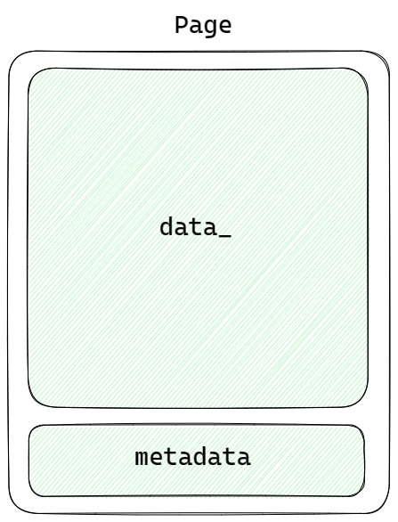

B+树的结点b_plus_tree_page就存储在`data_`中。


#### BPlusTreePage

B+树中有两种类型的结点，一种是内部结点，一种是叶结点。内部结点不存储所需的数据索引，内部结点的值指向下一层内部结点或叶结点。只有叶结点存储所需的数据索引。

* 内部结点：`BPlusTreeInternalPage`
* 叶节点：`BPlusTreeLeafPage`

`BPlusTreePage`是`BPlusTreeInternalPage`和`BPlusTreeLeafPage`的父类，其属性有：

```C++
IndexPageType page_type_;
lsn_t lsn_;
int size_;
int max_size_;
page_id_t parent_page_id_;
page_id_t page_id_;
```

这些属性组成了BPlusTreePage的Header，共占24字节。

#### BPlusTreeInternalPage

`BPlusTreeInternalPage`是B+树的内部结点，其成员变量只有一个数组。

```C++
MappingType array_[1];
```

这个是柔性数组（flexible array）。 当一个类中有一个成员为数组。但是在用这个类初始化一个对象时，不能确定该将这个数组的大小设置为多少，但知道这整个对象的大小是多少字节，可以用到 flexible array。

flexible array 必须是类中的最后一个成员，并且仅能有一个。在为对象分配内存时，flexible array 会自动填充，占用未被其他变量使用的内存。

```C++
class demo{
    int a;          // 4 bytes
    int array_[1];  // unknown size
}
```

例如这个demo类，在示例化该类时，分配给其20字节的空间，那么`array_`就有16字节的空间可以存储数据，`array_`的大小就为 16 / 4 = 4。

这样在`BPlusTreeInternalPage`中，`array_`数组就可以存储多个KV对。`array_`数组的大小就是`(BUSTUB_PAGE_SIZE - INTERNAL_PAGE_HEADER_SIZE) / (sizeof(MappingType))`。

 其中，`BUSTUB_PAGE_SIZE`的大小为4KB，内部结点的Header为24B。

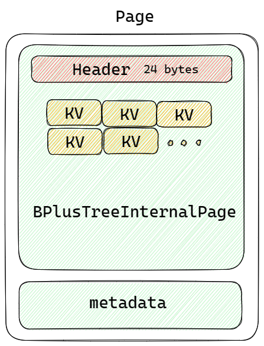

对于内部结点`BPlusTreeInternalPage`中的Key-Value对，Key是可以比较的键，Value是page_id。

将第一个Key设为空，这样有n-1个key，n个value，符合比较的逻辑。

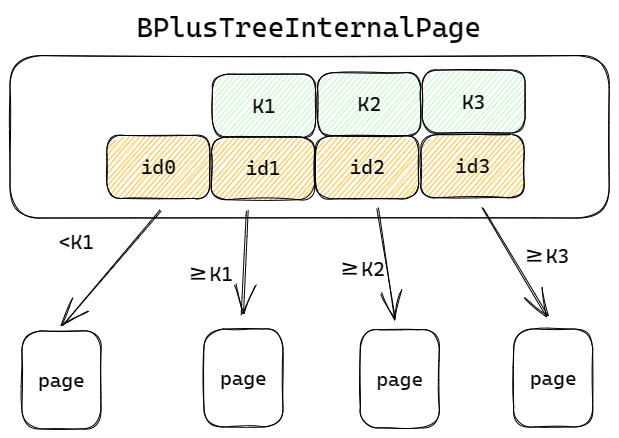

#### BPlusTreeLeafPage

`BPlusTreeLeafPage`是B+树的叶结点， leaf page 和 internal page 的内存布局基本一样，只是 leaf page 多了一个成员变量 `next_page_id`，指向下一个 leaf page（用于 range scan）。因此 leaf page 的 header 大小为 28 Byte。 


## Task #2 - B+Tree Data Structure

完成三个函数，插入(`Insert()`)，结点查找(`GetValue()`)，删除(`Delete()`)

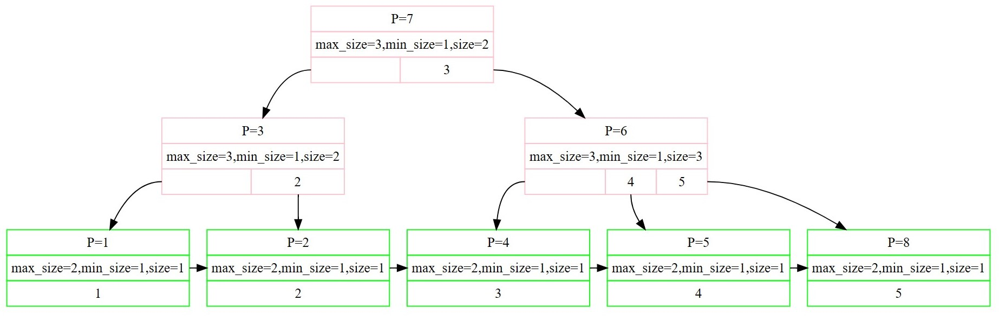

如上图B+树所示，内部结点的`max_size=3`，叶结点的`max_size=2`。`min_size`为`max_size / 2`。

对于叶结点来说

* 其内部存储的键值对数目要小于`max_size`，键值对数目一旦等于`max_size`，叶节点就需要分裂。
* 其内部存储的键值对数目可以等于`min_size`，键值对数目小于`min_size`再借键值对或合并。

对于内部结点来说

* 其内部存储的键值对数目可以等于`max_size`，如果要插入第`max_size+1`个结点，需要先分裂再插入。
* 其内部存储的键值对数目要大于`min_size`，键值对数目小于等于`min_size`时借键值对或合并。

理清`max_size`和`min_size`，方便在插入时选择分裂的时机，以及在删除时选择借键值对或合并的时机。

### 查找(`GetValue()`)

查找的目标是查找key所对应的value，需要从根节点开始，一层一层的查找。

在所有的结点中，key都是有序排列的。从根结点开始，在结点中所有的KV对中进行检索，找到合适的value之后，进入下一个结点，递归地向下查找，直到到达叶结点。（在每个结点内进行检索时，可以使用二分检索来提高检索速度。）

值得注意的是，在结点查找时，需要找到目标叶结点然后返回目标value，在插入和删除时，同样需要找到目标叶结点，对目标叶结点中的KV对进行插入或删除。所以这里将寻找目标叶结点的操作封装成一个方法`FindLeafPage()`

函数`FindLeafPage()`完成递归查找的操作。从 root page 开始查找。在查找到 leaf page 时返回，否则根据 key 在当前 internal page 中找到对应的 child page id，进入child page查找。这里可以使用while循环实现，也可以递归实现。

##### buffer pool manager

值得一提的是此处对于buffer pool manager的使用。

当需要页号为`page_id`的页面时，需要调用buffer pool manager中的方法：

```C++
Page *page = buffer_pool_manager_->FetchPage(page_id);
```

当需要一个新页面时：

```C++
page_id_t new_page_id = -1;
Page *new_page = buffer_pool_manager_->NewPage(&new_page_id);
```

##### reinterpret_cast

 page 的 `data_` 字段是实际用于存储数据的部分。 这里`data_`存储的是B+树结点，需要通过 `reinterpret_cast` 将这个数据部分强制转换为我们要使用的类型。

```C++
auto b_plus_tree_page = reinterpret_cast<BPlusTreePage *>(page->GetData());
```

 `reinterpret_cast` 用于无关类型的强制转换，转换方法很简单，原始 bits 不变，只是对这些 bits 用新类型进行了重新的解读。可想而知这种转换非常不安全，需要确保转换后的内存布局仍是合法的。

##### unpin page

在页面使用完之后，需要unpin page。

```C++
buffer_pool_manager_->UnpinPage(page_id, true);
```

因为`FetchPage`一次，`pin_count`就会+1，所以，调用`FetchPage`方法并且page使用完成后，都需要`Unpin`。

### 插入(`Insert()`)

插入一个KV对到叶结点中。首先需要从根结点开始检索，找到目标叶结点，在叶结点中合适的位置插入，插入之后需要判断是否需要分裂。寻找叶结点用到前面所封装的方法`FindLeafPage()`。

插入操作的重点是分裂操作。

* 在叶结点中插入KV对之后，需要检测叶结点的键值对数目是否等于`max_size`，如果等于`max_size`，则需要分裂出一个兄弟结点，该兄弟结点分担一半的KV对。
* 对于叶结点的父节点来说，需要插入一个KV对，指向新分裂出来的兄弟结点。但是在插入之前，需要检测该节点键值对数目是否等于`max_size`，如果等于，则需要先分裂，再插入。然后继续递归地向上检测、插入。


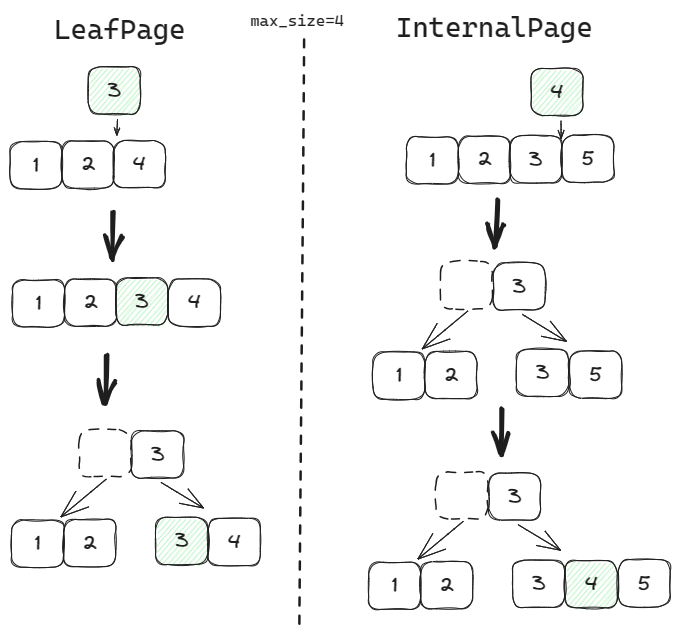

在分裂操作中，有一些细节需要注意，1. 当分裂结点为叶结点时，设置待分裂结点和新分裂结点的`next_page_id_`；2. 设置新分裂结点的父结点值；3. 当分裂结点为内部结点时，在其子结点重新分配时，注意调整每个子结点的`parent_page_id_`。

### 删除(`Delete()`)

要删除一个KV对，同样需要从根结点开始检索到目标叶结点，然后进行删除操作，删除后需要检测该叶结点存储的键值对数量是否小于`min_size`，如果小于`min_size`，那个该叶结点可以依次进行两个操作：1. 向其兄弟结点借一个键值对（前提是其兄弟结点键值对数量是否大于`min_size`）；2. 如果无法借到键值对，就需要找一个兄弟结点合并。如果叶结点进行了合并操作，意味着其父节点中的需要删除一个键值对，这样一次递归的检测并删除。

在删除key = 3的键值对后，叶结点向其左兄弟结点借了一个键值对。

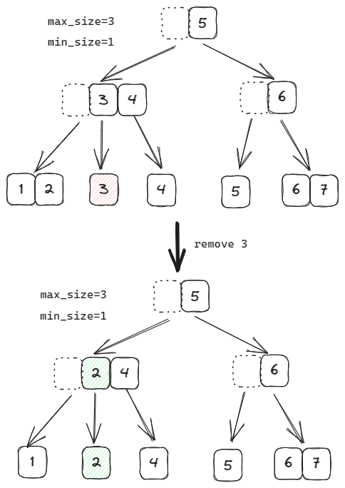

在删除key = 4的键值对后，结点无法向兄弟结点借键值对，只好与兄弟结点合并。在算法实现的时候，可以先检测一下左结点是否可以借，再检测一下右结点是否可以借，如果都不可以借，再进行合并的操作。当然，对于一个内部结点的第一个子结点，只能检测其右结点是否可借；最后一个子结点，只能检测其左结点是否可借。

合并意味着其中一个页面需要删除掉，这里需要使用`buffer_pool_manager_`中的方法`DeletePage()`。

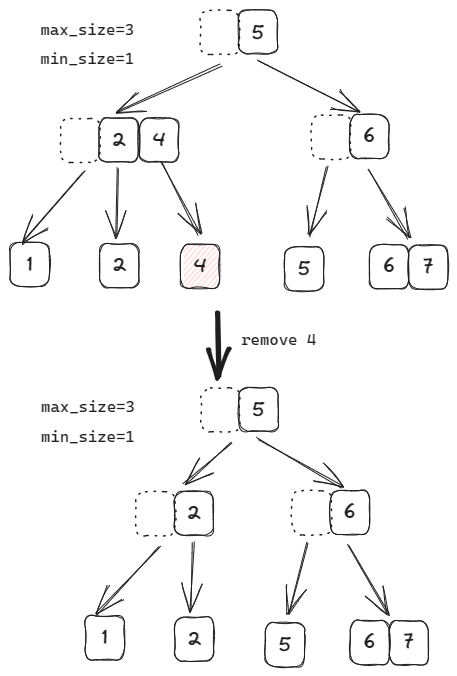

当内部结点需要借键值对或者合并时，需要注意对第一个“无效”key赋值。

当key=2的键值对被删除后，叶结点发生合并，其父结点需要删除键值对，递归向上检测，由于内部结点无法向后一个内部结点借键值对，该内部结点也需要合并，合并效果如图中step 2。这里需要注意的是，我们约定内部结点第一个key“无效”，所以后一个内部结点的第一个key需要从其父节点中下沉过来。

内部结点合并后，需要其父结点删除键值对。因为其父结点是根结点，删除键值对后，根节点size = 1，这时可以删除该根结点，并替换根节点，如图中step 3。

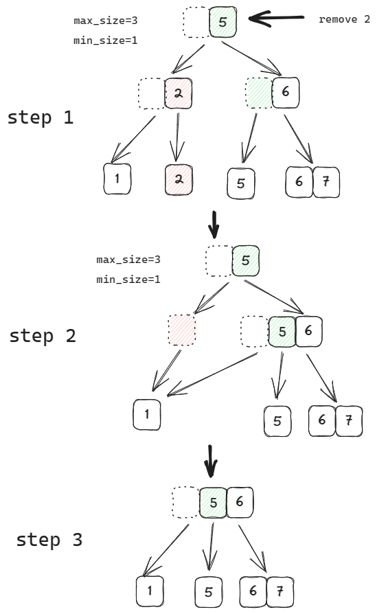

需要注意的是，root page 并不受 `min_size`的限制。如果 root page 被删到 size = 1，即只有一个 child page 的时候，应将此 child page 设置为新的 root page。 

同时，在合并结点的过程中，在step 2中，key=1所在的结点的父节点发生了变更，所以在合并时，需要注意调整`parent_page_id`。


## Task #3 - Index Iterator

该部分实现迭代器的`Begin()`, `End()`, `operator*()`, `operator++()`等方法，属实是增加了对Iterator底层代码的理解。

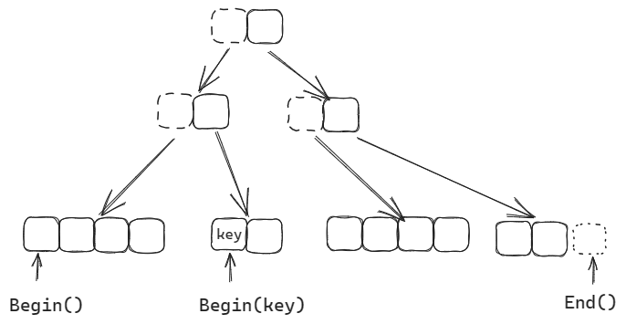

迭代器需要存储叶结点指针和键值对的索引值，同时，当检索到下一个叶结点时，需要FetchPage，所以还需要存储buffer_pool_manager_的指针。

Begin()方法就是找到最左侧的叶结点，index设置为0；End()方法就是找到最右侧的叶结点，index设置为GetSize()的大小，即当前结点键值对个数（最后一个键值对索引值的下一个）。

在递增时需要注意，超出该叶结点范围之后，需要Fetch下一个叶结点，同时Unpin刚遍历过的叶结点。


## Task #4 - Concurrent Index

为了让B+树支持并发，需要对其进行加锁。一把大锁的效率显然是比较低的，所以根据课程内容，使用 latch crabbing的加锁方式。

这种加锁方式，就像螃蟹一样，移动一只脚，放下，移动另一只脚，再放下。

基本思想是： 

1. 先锁住 parent page， 

2. 再锁住 child page， 

3.  假设 child page 是”安全“的，则释放 parent page及其父结点的锁。

“安全”指当前 page 在当前操作下一定不会因插入操作而分裂，不会因删除操作而借键值或合并。

同时，“安全”对不同操作的定义是不同的，Search 时，任何节点都安全；Insert 时，判断 max_size；Delete 时，判断 min_size。 所以上锁的时候，需要根据操作的不同，实施不同的上锁策略。

在查找，插入，删除操作中，都会用到方法`FindLeafPage()`从上到下检索目标叶结点。因此在Take #4中需要修改之前实现的`FindLeafPage()`方法，使该方法在从上到下的检索过程中，给相应的结点上锁。

### 查找(`GetValue()`)

查找操作的上锁过程最简单，先锁住 parent page，当锁住 child page 的时候，就可以给 parent page 解锁。

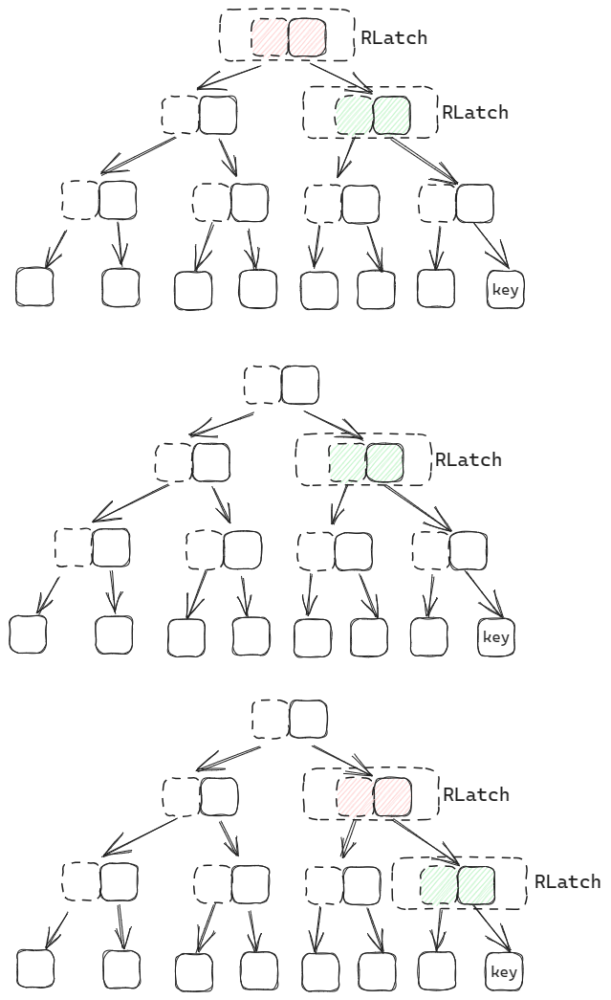

从根结点到叶结点，依次进行上锁解锁操作。

### 插入(`Insert()`)

插入操作在逐层寻找目标结点时，需要遵循以下操作：1. 先锁住 parent page， 2. 再锁住 child page， 3. 假设 child page 是”安全“的，则释放 parent page及其父结点的锁。

在图中，当检索到叶结点时，发现其是“安全”的，即插入一个键值对不会导致分裂，所以这时可以释放掉路径上的所有祖先锁。待插入操作完成后，再释放掉叶结点的`WLatch`。

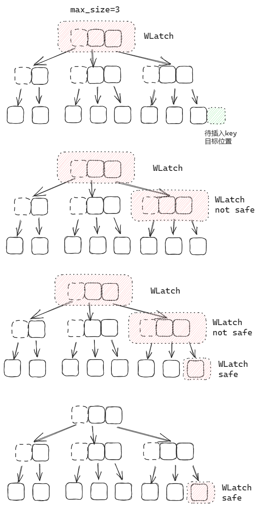

当然，如果子结点不“安全”，父结点的锁需要保持下来，以备后续可能对父结点进行操作。这里需要用到参数`transaction`，该类中有属性`page_set_`用来保存事务中所用到的page的指针。每当对一个page上锁之后，调用`transaction`中`AddIntoPageSet()`方法，将该page指针加入 `page_set_`。当遇到安全的子结点时，将`page_set_`中page所持有的锁释放掉。最后，当所有操作完成后，对`page_set_`所有page所持有的锁释放掉。

因为上层结点访问的更为频繁，例如每次操作都会从根结点开始查找，所以释放锁的顺序可以是从上到下。


### 删除(`Delete()`)

删除操作上锁同样遵循以下思想：1. 先锁住 parent page， 2. 再锁住 child page， 3. 假设 child page 是”安全“的，则释放 parent page及其父结点的锁。

在检索过程中，每当对一个page上锁之后，调用`transaction`中`AddIntoPageSet()`方法，将该page指针加入 `page_set_`。

如果没有安全的子结点，整条搜索路径上面的结点都可能被锁住，然后从叶结点开始递归地进行删除操作。

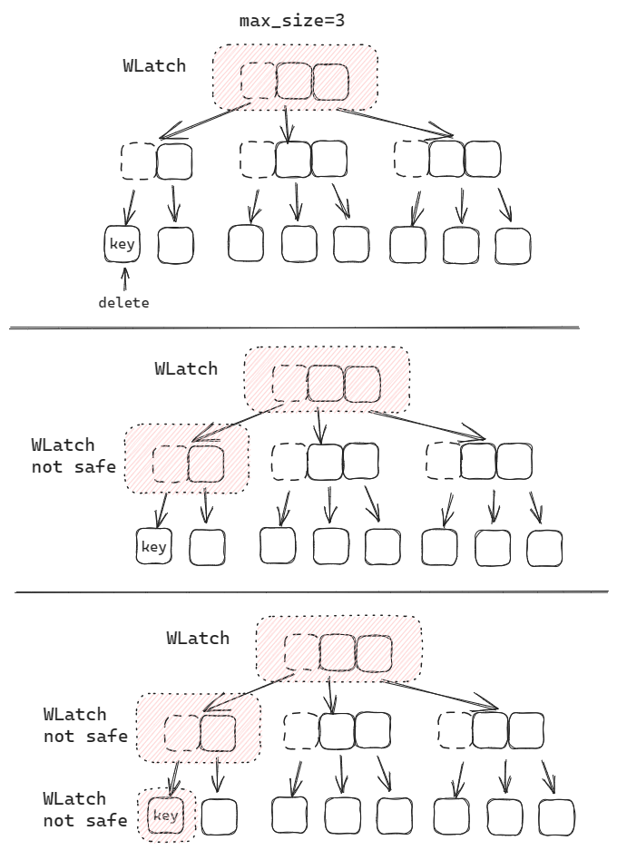

在该例子中，删除目标键值对后，该叶结点的所含键值对数目小于`min_size`，且无法向兄弟结点借键值对，所以需要删除。而对于内部结点来说，是可以向其兄弟结点借一个键值对，这时需要给兄弟结点上锁，但是无需加入`transaction`，当兄弟结点使用完成后立即释放锁就好。

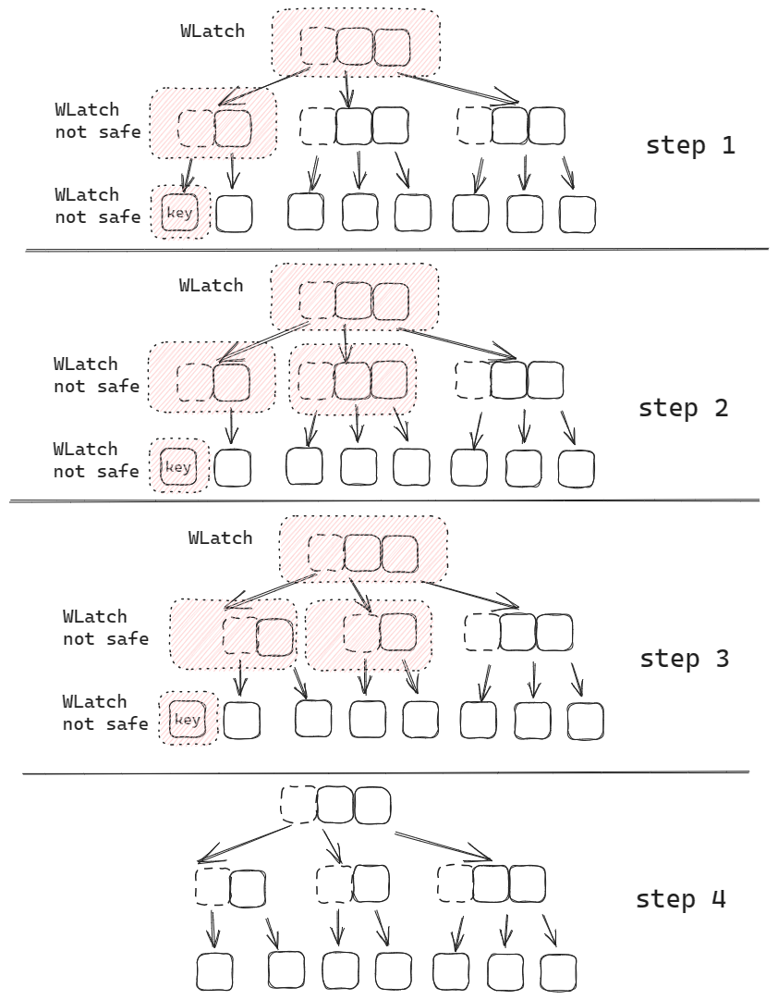

#### Unlatch & Unpin

根据题目的提示，对一个Page来讲，需要先释放锁，再Unpin。

从逻辑上讲，假设从根结点到叶结点这条路径上面的页面依次Fetch并锁住，并按序加入`page_set_`(该页面集使用的数据结构为双端队列)，在递归向上操作的时候，仅需要反向取出即可，无需再使用`buffer_pool_manager_`Fetch一次。

但是由于初步实现时，没有锁住B+树，导致transaction中有一些顺序问题，所以在Debug的时候，每次调用上锁的父结点，又使用`buffer_pool_manager_`Fetch一次。所以在逻辑上， 这里页面`pin_count_`为2，需要Unpin两次。

同时，程序测试时也出现了新建两个根结点的情况，分析是没有锁住B+树导致。


## Debug

#### Comparator接口：自定义比较器


在使用类模板的时候，由于KeyType未知，所以无法直接比较大小，可以传入一个KeyComparator作为自定义比较器来比较。

```C++
BPlusTree<KeyType, ValueType, KeyComparator>
```

例如，自定义int类型比较，

```C++
class IntComparator {
 public:
  inline auto operator()(const int lhs, const int rhs) const -> int {
    if (lhs < rhs) {
      return -1;
    }
    if (rhs < lhs) {
      return 1;
    }
    return 0;
  }
};
```

当然也可以定义其他类型的比较器

```C++
class HashComparator {
 public:
  inline auto operator()(const hash_t lhs, const hash_t rhs) -> int { 
      return lhs < rhs ? -1 : (lhs > rhs ? 1 : 0);
  }
};
```

Comparator重载了`()`，以进行比较，具体用法：

```C++
IntComparator comparator;
auto result = comparator(1, 2);
```

重载后使用非常像函数调用，所以又称为“仿函数”。


#### 模板初始化

在`b_plus_tree_internal_page.h`和`b_plus_tree_leaf_page.h`都使用宏定义来定义模板类型

```C++
// b_plus_tree_internal_page.h
#define B_PLUS_TREE_INTERNAL_PAGE_TYPE BPlusTreeInternalPage<KeyType, ValueType, KeyComparator>
// b_plus_tree_leaf_page.h
#define B_PLUS_TREE_LEAF_PAGE_TYPE BPlusTreeLeafPage<KeyType, ValueType, KeyComparator>
```

但是当在`b_plus_tree.cpp`使用宏定义时，会报错。提示`parent_page_b`中的函数未定义。是使用宏定义实例化失败导致。

```C++
// b_plus_tree.cpp
// create parent brother page
page_id_t parent_id_b;
auto page_b = buffer_pool_manager_->NewPage(&parent_id_b);
auto parent_page_b = 
    reinterpret_cast<B_PLUS_TREE_INTERNAL_PAGE_TYPE *>(page_b->GetData());
parent_page_b->Init(parent_id_b, parent_page->GetParentPageId(), internal_max_size_);
```

因为b_plus_tree实例化时模板参数类型和b_plus_tree_internal_page实例化时模板参数类型不同。

```C++
// b_plus_tree.cpp
template class BPlusTree<GenericKey<4>, RID, GenericComparator<4>>;
// b_plus_tree_internal_page.cpp
template class BPlusTreeInternalPage<GenericKey<4>, page_id_t, GenericComparator<4>>;
```

因此不能盲目地使用宏定义中的模板，况且，头文件中写好了模板类型的别名：

```C++
// b_plus_tree.h
using InternalPage = BPlusTreeInternalPage<KeyType, page_id_t, KeyComparator>;
using LeafPage = BPlusTreeLeafPage<KeyType, ValueType, KeyComparator>;
```

reinterpret_cast的类型修改如下：

```C++
auto parent_page_b = reinterpret_cast<InternalPage *>(page_b->GetData());
```


#### auto & const

 在C++11标准中，`auto`关键字不仅可以用于变量声明时自动推导数据类型，也可以用于函数返回值的推导。 


```C++
auto func(int x) const -> decltype(x) {
    return x;
}
```

在这个函数声明中，`const`关键字位于参数列表后面，表示这是一个`const`成员函数，即该函数不会修改任何成员变量，可以在`const`对象上调用。`const`关键字在这里是用来修饰`this`指针的。函数返回值并不是一个const类型的参数值。

```C++
auto func(int x) -> const decltype(x) {
    return x;
}

const auto func(int x) -> decltype(x) {
    return x;
}
```

这个函数声明中，`const`关键字位于返回类型前面，即修饰返回类型。这种情况下，`const`关键字表示函数返回值的类型是一个常量类型。也就是说，返回的值是一个常量，无法被修改。 

 

#### 声明参数默认值

```C++
error: redeclaration of ‘func()’ may not have default arguments
```

对于函数中参数的默认值，在定义的时候声明即可，无需在实现的时候再写一次。

即在`.h`文件中声明默认值，在`.cpp`文件中实现函数时无需再声明默认值。


绘图工具：[Excalidraw](https://excalidraw.com/)