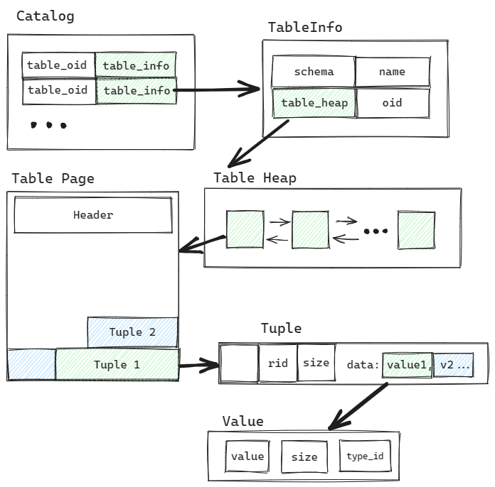

# Project # 3 - Query Execution

**CMU15-445 FALL 2022 Project#3 - Query Execution**

题目要求： [Project #3 - Query Execution | CMU 15-445/645 :: Intro to Database Systems (Fall 2022)](https://15445.courses.cs.cmu.edu/fall2022/project3/) 

任务：

* Task #1: Access Method Executor。 

  包含 SeqScan、Insert、Delete、IndexScan 四个算子。 

* Task #2: Aggregation and Join Executors。 

  包含 Aggregation、NestedLoopJoin、NestedIndexJoin 三个算子。 

* Task #3: Sort + Limit Executors and Top-N Optimization。 

  包含 Sort、Limit、TopN 三个算子，以及实现将 Sort + Limit 优化为 TopN 算子。 

## 概述


### 从语句到执行计划

一条SQL语句要被DBMS所理解执行，需要先经过语法分析，然后需要binder操作，通俗来讲就是将SQL语句中标识转化为DBMS内部的表示形式。然后生成执行计划，经过优化后执行。

经过语法分析形成抽象语法树（ AST, abstract syntax tree ）。

在Binder部分，会将SQL绑定到数据库实体。 

```sql
SELECT colA FROM table1;
```

其中 `SELECT` 和 `FROM` 是关键字，`colA` 和 `table1` 是标识符。Binder 遍历 AST，将这些词语绑定到相应的实体上。实体是 Bustub 可以理解的各种 c++ 类。

之后根据绑定后的语法树生成执行计划，执行计划也是一颗树。

对于题目中例子：

```sql
SELECT colA, MAX(colB) FROM
  (SELECT * FROM table_1, table_3 WHERE colA = colE) GROUP BY colA;
```

首先会对table_1和table_3进行扫描，对符合条件的元组进行Join操作，之后还需要对结果进行聚合。

这一系列操作形成一个树型的执行计划：


在执行阶段，数据从叶结点流向根结点，最终得到所需的结果。

将查询计划交给 Optimizer 进行修改优化，生成优化过后的最终查询计划。 

### 执行模型

Project 3 中主要围绕**查询执行**部分和**优化**部分。

在查询计划优化之后，可以根据查询计划生成执行计划的算子。也就是Project 3 需要实现的。

执行模型有三种：

1. 迭代模型  Iterator Model 
   * 又称“火山模型”或者“流水线模型”。
   *  每个算子都有 `Init()` 和 `Next()` 两个方法。`Init()` 对算子进行初始化工作。`Next()` 则是向下层算子请求下一条数据。当 `Next()` 返回 false 时，则代表下层算子已经没有剩余数据，迭代结束。 
2. 物化模型  Materialization Model 
   * 迭代模型的特化。每一个 Operator 返回所有的元组。
   * 如果数据量大，内存占用就会比较高。适合OLTP。
3. 向量/批处理模型  Vectorization Model 
   * 从根节点到叶子结点自上而下地递归调用 next() 函数，每一次传递一批元组，而不是一个元组。

 Bustub 采用的是迭代模型 Iterator Model。

并且执行方向选择自顶向下，从根结点算子开始，向子结点拉取数据。

### 组织架构

在叶结点查找数据时，需要找到数据所在位置，Catalog中标明了相关数据的位置。

**Catalog**

Catalog中包含了表号等到表的映射，还有索引号等到索引表的映射。当执行查询计划时，`plan_`中存有目标`Table`的表号或者索引号，调用Catalog中的含参方法找到对应的`TableInfo`或者`IndexInfo`，在`TableInfo`中有指向`Table Heap`的指针。因为一个表如果比较大，所以需要若干个页才可以容纳，那么一个表需要占用若干`Page`，`Table Heap`将这些页组织起来，封装成一个堆，这样上层的调用者不必关心分页的细节，只需要调用其中方法即可。

一个表可能需要若干`Page`来存储，对于一个`Table Page`来说，除了元数据之外，是由一个一个`Tuple`组成。对于Tuple来讲，除了元数据，特别是唯一标识RID (page_id + slot_num) ，还有属性值Value。



了解以上数据结构，有利于在接下来的编码中找到方向，明确如何从系统中找到数据。

在该部分中，所需要的系统资源，如Catalog，需要在 `ExecutorContext `中调用相应的接口。

**算子抽象类， AbstractExecutor **

其中的`Init()`和`Next()`函数是需要实现的。

`void Init()`：用于初始化，在`Next()`之前调用。

`bool Next(Tuple *tuple, RID *rid)`：该函数的Tuple和RID作为输出参数，用于获取下一层结点提供的下一条数据。如果没有则返回false。

其中值得一提的是Schema。Schema存储了一个列向量，类似于`(__mock_table_1.colA:INTEGER, __mock_table_1.colB:INTEGER)`，Column包含了列名、列类型、列在tuple中的偏移量、列大小等信息。 简单来讲就是Tuple中列的信息以及列是如何排布的。

**执行计划抽象类，AbstractPlanNode**

这个代表了执行计划树结点的基类，有一个指示输出的schema，还有子计划结点的向量。

**表达式抽象类，AbstractExpression**

用来表示表达式。其也是树状结构。

## Task #1: Access Method Executor

### SeqScan

根据上下文获取Catalog， 通过Catalog的接口找到数据表，对表中的Tuple进行顺序遍历，使用`TableIterator`可以实现。

在类中存储迭代器和迭代结束的End()标志，Next()函数每次只需返回一个Tuple。

### Insert

插入算子，将元组插入到数据表中，同时也要对索引进行更新。

这里要求返回一个 Insert 成功的元组数，所以不再是调用一次 Next() 函数处理一个Tuple。

在Insert 算子的 Next() 函数中，循环接收孩子结点提供的 Tuple ，并计数。然后根据上下文信息，根据Catalog找到相应的数据表提供的接口，完成数据表的元组插入以及索引的插入。这里需要注意的是，一个表可能建立多个索引，这里所有的索引都需要完成插入操作。

最后将计数封装成 Tuple 输出。

### Delete

删除算子和插入算子类似，完成元组的删除操作。项目给出的接口并不是直接删除，而是将 tuple 标记为删除状态，也就是逻辑删除。（在事务提交后，再进行物理删除，Project 3 中无需实现） 

同样，在 Delete 算子的 Next() 函数中，对孩子结点提供的所有元组进行删除操作，包括数据表和索引，最后将计数封装成 Tuple 输出。删除索引时使用到 DeleteEntry() 需要注意其参数。

### IndexScan

索引依赖B+树建立，算子内部就需要保存一个指向索引的指针，还有遍历时使用的迭代器。

在索引赋值时，根据提示使用即可：

```C++
dynamic_cast<BPlusTreeIndexForOneIntegerColumn *>()
```

dynamic_cast 在 Project2 中也用到过，这里再多说几句。dynamic_cast 是 C++ 中的一种类型转换操作符，用于在运行时进行类型安全的向下转型（downcast）和跨继承链的向上转型（upcast）。

其中，new_type 表示需要转换的目标类型，expression 是需要转换的对象指针或引用。dynamic_cast 执行以下操作：

1. 检查 expression 是否能够转换为指定的类型 new_type。如果不能转换，dynamic_cast 返回一个空指针（对于指针转换）或抛出一个 std::bad_cast 异常（对于引用转换）。
2. 如果可以转换，则进行转换，并返回一个指向 new_type 类型的指针（对于指针转换）或引用（对于引用转换）。

dynamic_cast 的一些重要用途包括：

1. 在多态情况下进行安全的向下转型。例如，将基类指针或引用转换为派生类指针或引用，以便访问派生类特有的成员函数或数据成员。
2. 跨继承链进行向上转型。例如，将派生类指针或引用转换为基类指针或引用，以便在不同的继承层次中传递对象。

需要注意的是，dynamic_cast 仅适用于具有多态性的类层次结构，也就是至少有一个虚函数。如果在 dynamic_cast 中使用了非多态类型，编译器会报错。

在该算子测试中，索引的建立依赖B+树这个数据结构，因此也用到了Project 2实现的B+树。这里也发现B+树在实现叶结点迭代时的一些不足之处。

## Task #2: Aggregation and Join Executors

### Aggregation

Aggregation 算子中除了下层算子和查询计划，还有两个成员：

```C++
SimpleAggregationHashTable aht_;
SimpleAggregationHashTable::Iterator aht_iterator_;
```

而对于`SimpleAggregationHashTable`，其内部成员是：

```C++
/** The hash table is just a map from aggregate keys to aggregate values */
std::unordered_map<AggregateKey, AggregateValue> ht_{};
```

这里表明 Aggregation 算子保存一个哈希表，哈希表的键为`AggregateKey`，值为`AggregateValue`。二者均为 均为 `std::vector`。 

 key 代表 group by 的字段的数组，value 则是需要 aggregate 的字段的数组。在下层算子传来一个 tuple 时，将 tuple 的 group by 字段和 aggregate 字段分别提取出来，调用 `InsertCombine()` 将 group by 和 aggregate 的映射关系存入 `SimpleAggregationHashTable`。 

```sql
SELECT min(t.z), max(t.z), sum(t.z) FROM t GROUP BY t.x, t.y;

Agg { types=[min, max, sum], aggregates=[t.z, t.z, t.z], group_by=[t.x, t.y] }

key = [t.x, t.y], value = [t.z, t.z, t.z]
```

想得到一个列中的min，要遍历整张表，所以该算子 Init() 函数中就遍历下层算子所提供的所有元组，将中间结果保存到哈希表中，在 Next() 函数中再将结果逐一输出。

在向哈希表插入数据需要用到函数`CombineAggregateValues()`，书写其内部代码时需要注意输入的Value是否为空类型，同时也要注意现有的Value是否为空类型。因为对于新插入的键，会有初始化操作：

```C++
case AggregationType::CountStarAggregate:
// Count start starts at zero.
values.emplace_back(ValueFactory::GetIntegerValue(0));
break;
case AggregationType::CountAggregate:
...
// Others starts at null.
values.emplace_back(ValueFactory::GetNullValueByType(TypeId::INTEGER));
break;
```

在Init() 函数中获得哈希表后，Next()函数就可以使用迭代器遍历，每次输出一个Tuple。这里组成Tuple的操作是将`AggregateKey`中的value和`AggregateValue`中的value拼接到一起就好。

根据题目，这里无需担心哈希表过大的问题， 整张 hashmap 可以驻留在内存中 。


这里有一个测试上细节。在聚合所操作表为空的情形中，有两种结果：

```sql
SELECT colA, MIN(colB) FROM __mock_table_1 GROUP BY colA;
/* 无输出 */
SELECT colA, MIN(colB) FROM __mock_table_1;
/* 输出NULL 或 0 */
```

对于以上两个语句有不同的输出形式。因此当没有`GROUP BY`时，需要添加如下的初始化操作。

```C++
void InsertInitialCombine() {
    ht_.insert({{std::vector<Value>()}, GenerateInitialAggregateValue()});
}
```


### NestedLoopJoin

嵌套循环连接思路上是比较简单的，两层循环，如果匹配就输出：

```
for outer_tuple in outer_table:
    for inner_tuple in inner_table:
        if inner_tuple matched outer_tuple:
            emit
```

但实现时有几个比较有趣的点。

1. 关于Next()函数每次只返回一条记录，需要处理的问题是内表有两个或以上匹配的记录。


​	这里的解决方案是，在算子中保存外表的当前记录，保证当前记录扫描完整的内表后再更替到下一条。

2. 还有一个问题是，在内表循环时，使用下层算子的Next()函数进行，当外表进行下一次循环时，内表算子的Next()函数返回的是false，无法重复循环。


​	这里就需要将内表信息保存到算子中，以便进行循环的遍历。

3. 当进行连接类型是`JoinType::LEFT`，并且此时内表没有匹配的元组时，需要注意补足NULL类型。


接下来是关于 left_tuple 和 right_tuple 如何匹配的问题。

 `AbstractExpression` 抽象了 SQL 中的各种表达式，

* `ArithmeticExpression`：算数表达式

* `ColumnValueExpression`：列值表达式

* `ComparisonExpression`：比较器

* `ConstantValueExpression`： 常量表达式

* `LogicExpression`： 逻辑表达式

```sql
select * from t where t.a = t.b + 1 and t.c > 0;
```

where子句后面的表达式可以表示成树状：


 SQL中的所有表达式都会被转化为表达式树，在 Binder 中进行绑定。  

在Join匹配时，调用`plan_->Predicate().EvaluateJoin()`可获取比较结果，类型为`Value`，需要判断比较结果为空的情况。

在构造输出结果时，需要将多个Value加入到Tuple中，组成该算子的输出。

在这里有左孩子的Tuple和右孩子的Tuple，根据项目指引是将二者Tuple中的Value直接拼接就好。

在输出时，应当根据使用`GetOutpueSchema()`找到输出策略。

```C++
for (uint32_t i = 0; i < left_executor_->GetOutputSchema().GetColumnCount(); i++) {
    values.push_back(left_tuple_.GetValue(&(left_executor_->GetOutputSchema()), i));
}
```

简单的使用`left_tuple`的列来计数是不合理的。

```C++
for (uint32_t i = 0; i < left_tuple.GetLength(); i++) {
    values.push_back(left_tuple_.GetValue(&(left_executor_->GetOutputSchema()), i));
}
```


### NestedIndexJoin

 JOIN ON 右边的字段上建了 index，则 Optimizer 会将 NestedLoopJoin 优化为 NestedIndexJoin。

具体实现和 NestedLoopJoin 差不多，只是在尝试匹配右表 tuple 时，会拿 join key 去 B+Tree Index 里进行查询。 


## Task #3: Sort + Limit Executors and Top-N Optimization

### Sort

这里`srd::sort`函数的比较规则可以使用`lambda`表达式（匿名函数）。

```C++
 std::sort(sorted_tuple_.begin(), sorted_tuple_.end(),
           [this](const Tuple &a, const Tuple &b) {
               // ...
            });
```

在匿名函数内部无法使用函数体外的变量，`[]`称作捕获列表，可以传递参数到函数内。

这里传递this指针，以便于访问`plan_`来获取排序的字段。

关于`std::sort`函数， 下面是[cppreference](https://en.cppreference.com/ )中的例子：

```C++
int main()
{
    std::array<int, 10> s {5, 7, 4, 2, 8, 6, 1, 9, 0, 3};
 
    auto print = [&s](std::string_view const rem)
    {
        for (auto a : s)
            std::cout << a << ' ';
        std::cout << ": " << rem << '\n';
    };
 
    std::sort(s.begin(), s.end());
    print("sorted with the default operator<");
 
    std::sort(s.begin(), s.end(), std::greater<int>());
    print("sorted with the standard library compare function object");
 
    struct
    {
        bool operator()(int a, int b) const { return a < b; }
    }
    customLess;
 
    std::sort(s.begin(), s.end(), customLess);
    print("sorted with a custom function object");
 
    std::sort(s.begin(), s.end(), [](int a, int b)
                                  {
                                      return a > b;
                                  });
    print("sorted with a lambda expression");
}
```

Output: 

```C++
0 1 2 3 4 5 6 7 8 9 : sorted with the default operator<
9 8 7 6 5 4 3 2 1 0 : sorted with the standard library compare function object
0 1 2 3 4 5 6 7 8 9 : sorted with a custom function object
9 8 7 6 5 4 3 2 1 0 : sorted with a lambda expression
```


### Limit

在内部维护一个计数器，记录已经 emit 了多少 tuple。当下层算子为空或 计数器到达plan中规定上限后，不再返回新的 tuple。 


### TopN

将 Sort + Limit 优化为 TopN。

这里要实现两个部分的代码，一是优化策略的代码，即查询计划树中的结点在什么情况下可以将优化为TopN，二是实现TopN算子的逻辑。

**优化策略**

查询计划遍历优化策略完成优化。

```C++
auto Optimizer::Optimize(const AbstractPlanNodeRef &plan) -> AbstractPlanNodeRef {
  if (force_starter_rule_) {
    // Use starter rules when `force_starter_rule_` is set to true.
    auto p = plan;
    p = OptimizeMergeProjection(p);
    p = OptimizeMergeFilterNLJ(p);
    p = OptimizeNLJAsIndexJoin(p);
    p = OptimizeOrderByAsIndexScan(p);
    p = OptimizeSortLimitAsTopN(p);
    return p;
  }
  // By default, use user-defined rules.
  return OptimizeCustom(plan);
}
```

项目也给出了部分优化策略的实现，可以作为参考，

下面的优化策略将“排序+顺序遍历”优化为“索引遍历”。从叶结点开始，自底向上的遍历，发现符合优化条件的结点，就对结点进行改写。

```C++
auto Optimizer::OptimizeOrderByAsIndexScan(const AbstractPlanNodeRef &plan) -> AbstractPlanNodeRef {
  std::vector<AbstractPlanNodeRef> children;
  for (const auto &child : plan->GetChildren()) {
    children.emplace_back(OptimizeOrderByAsIndexScan(child));
  }
  auto optimized_plan = plan->CloneWithChildren(std::move(children));

  if (optimized_plan->GetType() == PlanType::Sort) {
  	// optimize
  }
}
```

根据这个思路，可以实现 Sort + Limit 优化为 TopN。


当遍历到查询计划结点的类型为 Limit 时，判断其孩子结点是否为 Sort ，若孩子结点为 Sort，则将

Sort + Limit 优化为 TopN。其中 Limit 只有一个孩子结点，因此只需要判断 children_[0]的类型是否为 Sort即可。


**算子逻辑**

在Sort算子中，使用`std::sort`函数进行排序，

快速排序（Quick Sort）的平均时间复杂度为O(nlogn)，最坏情况下的时间复杂度为O(n^2)，其中n为待排序元素的数量。

堆排序（Heap Sort）的时间复杂度为O(nlogn)，其中n为待排序元素的数量。

堆排序的优势在于它能保证最坏情况下的时间复杂度仍是O(nlogn)，而不受输入数据的影响。同时，堆排序还具有原地排序的特点，不需要额外的存储空间。

 在 C++ 中，`std::priority_queue` 是基于堆（Heap）实现的，它的内部数据结构是一个数组或向量，用于存储堆中的元素，同时还有一个比较函数，用于比较元素的大小关系。

默认情况下是大根堆，使用 `std::less` 作为比较函数 。当堆中插入元素时比较过程如下：

1. 将新元素插入到堆的末尾。
2. 将新元素与它的父节点进行比较。
3. 如果新元素与父节点的值满足堆的性质（在最大堆中，新元素的值小于等于父节点的值），则插入操作完成。
4. 如果新元素的值大于父节点的值（在最大堆中），则交换新元素与父节点的位置。
5. 重复步骤 2 和步骤 4，直到新元素满足堆的性质或者到达堆的顶部（根节点位置）为止。

在 [cppreference](https://en.cppreference.com/w/cpp/container/priority_queue) 中有使用方法的举例：

```C++
const auto data = {1, 8, 5, 6, 3, 4, 0, 9, 7, 2};

std::priority_queue<int> q1; // Max priority queue

// Min priority queue
// std::greater<int> makes the max priority queue act as a min priority queue
std::priority_queue<int, std::vector<int>, std::greater<int>>
    minq1(data.begin(), data.end());

// Second way to define a min priority queue
std::priority_queue minq2(data.begin(), data.end(), std::greater<int>());

// Using a custom function object to compare elements.
struct
{
    bool operator()(const int l, const int r) const { return l > r; }
} customLess;
std::priority_queue minq3(data.begin(), data.end(), customLess);

// Using lambda to compare elements.
auto cmp = [](int left, int right) { return (left ^ 1) < (right ^ 1); };
std::priority_queue<int, std::vector<int>, decltype(cmp)> q5(cmp);
 
```

这里可以使用 lambda 函数声明优先队列，比较函数可以使用 sort 算子中实现的，但是要注意根据堆的性质调整一下返回值。


绘图工具： [Excalidraw](https://excalidraw.com/) 