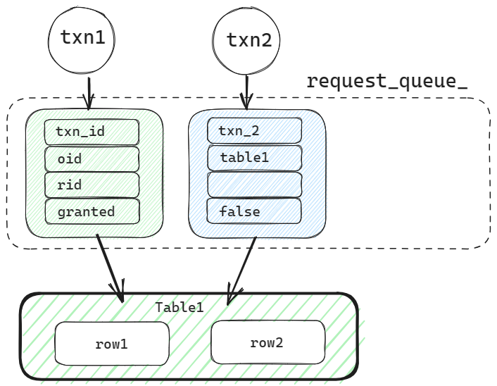
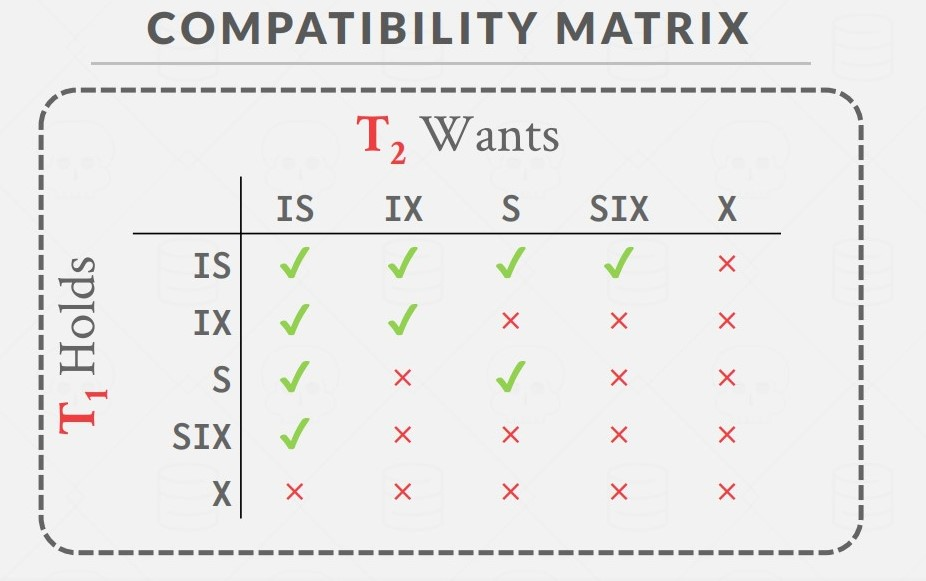
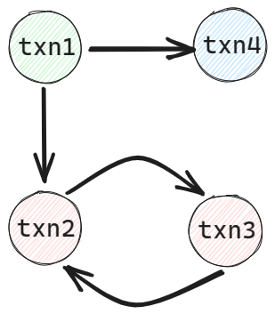
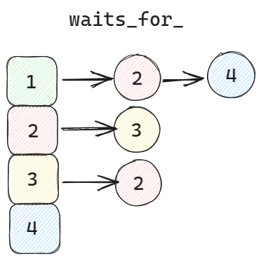

# Project #4 - Concurrency Control

**CMU15-445 FALL 2022 Project#4 - Concurrency Control**

题目要求： [Project #4 - Concurrency Control (Fall 2022)](https://15445.courses.cs.cmu.edu/fall2022/project4/) 

- **Task #1 - Lock Manager**  锁管理器。

  利用 2PL 思想实现并发控制。事务在`GROWING`阶段上锁，在`SHRINKING`阶段解锁。

  支持 `REPEATABLE_READ`、`READ_COMMITTED` 和 `READ_UNCOMMITTED` 三种隔离级别。不同隔离级别对不同类别的锁有不同要求。锁的类别有五种： `SHARED`、`EXCLUSIVE`、`INTENTION_SHARED`、`INTENTION_EXCLUSIVE` 和 `SHARED_INTENTION_EXCLUSIVE` 。支持锁升级。 

  支持 table 和 row 两种锁粒度。

- **Task #2 - Deadlock Detection**  死锁检测

  实现一个死锁检测算法，终止特定事务，解决事务对资源的循环等待。

- **Task #3 - Concurrent Query Execution**

  修改 `SeqScan`、`Insert` 和 `Delete` 算子，加上适当的锁以实现并发的查询。


## 概念

**脏读**

脏读是指读到了其他事务未提交的数据。未提交意味着这些数据可能会回滚，也就是可能最终不会存到数据库中，也就是不存在的数据 。

**不可重复读**

不可重复读指的是在一个事务内，不同时刻读到的同一批数据都是不一致的。可能会受到其他事务的影响，比如其他事务改了这批数据并提交了。通常针对数据更新（UPDATE）操作。 

**幻读**

幻读是针对数据插入（INSERT）操作来说的。假设事务A对某些行的内容作了更改，但是还未提交，此时事务B插入了与事务A更改前的记录相同的记录行，并且在事务A提交之前先提交了。而这时，在事务A中查询，会发现好像刚刚的更改对于某些数据未起作用，但其实是事务B刚插入进来的，感觉出现了幻觉，这就叫幻读。 

**四种隔离级别**

1. 读未提交（READ UNCOMMITTED）
2. 读提交 （READ COMMITTED）
3. 可重复读 （REPEATABLE READ）
4. 串行化 （SERIALIZABLE）

|                  |  脏读  | 不可重复读 |  幻读  |
| :--------------: | :----: | :--------: | :----: |
| READ UNCOMMITTED |  可能  |    可能    |  可能  |
|  READ COMMITTED  | 不可能 |    可能    |  可能  |
| REPEATABLE READ  | 不可能 |   不可能   |  可能  |
|   SERIALIZABLE   | 不可能 |   不可能   | 不可能 |

从上到下，隔离级别逐渐增强。


## Task 1 - 锁管理

当事务需要对数据表进行操作时，向锁管理器发送一个请求。

而锁管理器的作用是，接收事务的锁请求，并合理的授予锁。具体来讲是将锁请求收集到一个列表中`request_queue_`，然后根据一定的规则（项目中使用先到先服务），将请求标记与授予，然后告知事务已获取指定资源的锁。

图中展示 txn1 先对table1发出锁请求，加入锁管理器的列表中，txn2 后发出对 table1 的锁请求，这时还没有授予锁，所以 granted 的值为 false 。



锁请求：`LockRequest`

```C++
txn_id_t txn_id_;  		// 事务号
LockMode lock_mode_;  	// 锁的类型，如共享锁，排他锁等
table_oid_t oid_;  		// 表号，对表和行上锁时均会用到
RID rid_;  				// 行的唯一标识，对行上锁时使用到
bool granted_{false};	// 是否授予锁的标志
```

类`LockRequestQueue`维护一个锁请求的列表，和其他属性：

```C++
// 锁请求的列表，存储所有的锁请求
std::list<std::shared_ptr<LockRequest>> request_queue_;
std::condition_variable cv_; 			// 信号量，通知阻塞的进程
txn_id_t upgrading_ = INVALID_TXN_ID; 	// 正在进行锁升级的事务号
std::mutex latch_; 						// 为实现并发，用于保护该数据结构的锁
```

对于每一个Table来说，该Table锁的请求被存放在一个请求队列中，通过哈希映射来存储，key为表id，value为该队列。

对于每一个Row来说同理，对每一个Row的请求被存放在一个队列中，key为Row的唯一标识“RID”，value为请求队列。

锁管理器中有两个哈希映射，分别存放是表锁请求队列的指针和行锁请求队列的指针。

```C++
std::unordered_map<table_oid_t, std::shared_ptr<LockRequestQueue>> table_lock_map_;
std::unordered_map<RID, std::shared_ptr<LockRequestQueue>> row_lock_map_;
```

项目需要实现的四个函数分别是对表上锁解锁，对行上锁解锁：

- `LockTable(Transaction, LockMode, TableOID)`
- `UnlockTable(Transction, TableOID)`
- `LockRow(Transaction, LockMode, TableOID, RID)`
- `UnlockRow(Transaction, TableOID, RID)`

### 上锁

上锁的大致思路是这样的：

1. 查看事务的状态和隔离级别

   根据隔离级别，判断事务所处的阶段是否可以上锁，上锁的类别是否合理。

2. 创建请求加入请求队列，

   这里根据表号或行号找到指定的映射，创建请求加入。

3. 遍历请求队列，在符合条件时授予锁。

具体来讲，上表锁的过程为：

**1. 查看事务状态和隔离级别**

如果事务的状态是中止 (ABORTED) 或者提交 (COMMITTED) 状态，不可以上锁，返回错误。

在2PL策略中，有两个阶段，”GROWING“ 和 ”SHRINKING“ 。三种隔离级别在不同的阶段会有不同的操作，对锁的类别也有不同的要求，因此需要判断是否合法。

当检测到不合法时，需要将事务的状态设置为 ”ABORTED" ，并抛出异常。在 “transaction.h” 文件中给出了中断原因，

```C++
enum class AbortReason {
  LOCK_ON_SHRINKING,
  UPGRADE_CONFLICT,
  LOCK_SHARED_ON_READ_UNCOMMITTED,
  TABLE_LOCK_NOT_PRESENT,
  ATTEMPTED_INTENTION_LOCK_ON_ROW,
  TABLE_UNLOCKED_BEFORE_UNLOCKING_ROWS,
  INCOMPATIBLE_UPGRADE,
  ATTEMPTED_UNLOCK_BUT_NO_LOCK_HELD
};
```

不同的隔离级别在 ”lock_manager.h“ 文件中有相应提示：

```C++
REPEATABLE_READ:
	The transaction is required to take all locks.
    All locks are allowed in the GROWING state
    No locks are allowed in the SHRINKING state

READ_COMMITTED:
	The transaction is required to take all locks.
    All locks are allowed in the GROWING state
    Only IS, S locks are allowed in the SHRINKING state

READ_UNCOMMITTED:
	The transaction is required to take only IX, X locks.
    X, IX locks are allowed in the GROWING state.
    S, IS, SIX locks are never allowed
```

在 ”SHRINKING“ 阶段，

**READ_UNCOMMITTED**： X，IX锁如果被申请，这是不被允许的，需要抛出异常。

**READ_COMMITTED**：只允许IS，S锁在SHRINKING阶段，如果出现其他类型的锁请求，则抛出异常。

**REPEATABLE_READ**：没有锁被允许在SHRINKING阶段申请。

之后，还应该注意到，在READ_UNCOMMITTED隔离级别中，S,，IS， SIX锁是不被允许的。


**2. 创建请求加入请求队列**

首先需要根据 “oid” 找到相应的请求队列。这里需要使用锁管理器中的 “table_lock_map_” 寻找队列。当然如果还未创建队列，需要给映射插入键值对。

需要注意的是，为保证多线程的正常进行，此处使用 “table_lock_map_” 需要对其上锁，当我们取得队列之后，先将队列上锁，然后再释放  “table_lock_map" 的锁为比较稳妥的选择。

这里有一个特别的点，**锁升级**，例如txn1已经获得了table1的S锁，此时，txn1又想获得table1的X锁，这种情况就出现了锁升级。

可以使用的策略是，遍历请求队列，如果发现请求中的txn_id_和将要创建的请求的id相同，就需要对队列中的该请求进行近一步判断：

* 如果该请求未被授予锁，则本次申请直接返回失败。
* 如果该请求申请的锁类型与本次申请的类型相同，并被授予锁，可以返回True。
* 判断是否符合锁升级的类型，即只可以升级为更严格的锁。
* 如果需要锁升级，同时需要判断请求队列中是否有锁在升级，如果有锁在升级，则返回锁升级冲突。

如果申请通过了一系列判断，那么就可以将申请加入请求队列了。当然，如果涉及到锁升级，可以将请求队列中的原请求删除，并把队列中正在升级的标志改为对应的事务ID。

这里需要提醒，在事务中，有多个集合，用来记录该事务拥有的锁：

```C++
/** LockManager: the set of table locks held by this transaction. */
std::shared_ptr<std::unordered_set<table_oid_t>> s_table_lock_set_;
std::shared_ptr<std::unordered_set<table_oid_t>> x_table_lock_set_;
std::shared_ptr<std::unordered_set<table_oid_t>> is_table_lock_set_;
std::shared_ptr<std::unordered_set<table_oid_t>> ix_table_lock_set_;
std::shared_ptr<std::unordered_set<table_oid_t>> six_table_lock_set_;

/** LockManager: the set of row locks held by this transaction. */
std::shared_ptr<std::unordered_map<table_oid_t, std::unordered_set<RID>>> s_row_lock_set_;
std::shared_ptr<std::unordered_map<table_oid_t, std::unordered_set<RID>>> x_row_lock_set_;
```

在释放锁或者上锁时，需要注意维护这部分信息。

**3. 遍历请求队列，在符合条件时授予锁。**

在请求队列维护完成后，就需要根据规则给相关请求授予锁。

这里由于是多线程并发，可能有许多事务在申请同一表锁，所以使用到条件变量`std::condition_variable cv_;`。 条件变量和锁，配合使用可以实现经典的等待资源的模型。 

首先需要持有锁，然后查看是否能够获取资源 (这里是指申请的表锁或行锁) 。若暂时无法获取资源，则调用条件变量的 wait 函数。调用 wait 函数后，latch 将自动释放，并且当前线程被挂起，以节省资源。当前线程阻塞，直到重新获得 latch 之后，再查看是否能获取资源。允许有多个线程在 wait 同一个 latch。 

```C++
std::unique_lock<std::mutex> lock(lock_request_que->latch_);
while (!GrantLock(lock_request_que.get(), request, txn)) {
  lock_request_que->cv_.wait(lock);
  // do something ..
  
}
```

当某线程使资源状态发生改变时，可以使用`notify_all()`函数，唤醒阻塞在当前资源的线程。

在线程被唤醒后，其仍处于 wait 函数中。在 wait 函数中尝试获取 latch。在成功获取 latch 后，跳出 wait 函数，进入循环的判断条件，检查是否能获取资源。若仍不能获取资源，就继续进入 wait 阻塞，释放锁，挂起线程。若能获取资源，则退出循环。

这样就实现了阻塞等待资源的模型。条件变量中的条件指的就是满足某个条件，在这里即能够获取资源。 

这里根据规则授予锁的实现在`GrantLock()`函数中，

首先，遍历队列，查看是否有已经授予的锁，判断锁的类型和申请锁的类型是否兼容。



如果不兼容则返回失败。如果兼容则函数继续。

这里的规则使用的是先到先服务 (First In First Out) ，但是由于锁升级比较特殊，所以锁升级有更高的优先级。

先判断锁升级标志ID是否为当前txn_id_，若是则授予锁，事务内部记录锁情况，并且将锁升级标志置为`INVALID_TXN_ID`。

如果没有锁升级，则正式进入FIFO规则。

从前向后遍历锁请求，在没有被授予锁的请求中，会出现两种情况

* 先遇到当前事务提出的请求，那么授予锁，返回True。
* 先遇到其他事务提出的请求，这里可以判断一下，遇到的请求锁类型是否与当前请求兼容，如果兼容的话，当前请求也可以授予锁。如果不兼容的话，根据FIFO规则，其他事务应当先获得锁，当前函数返回False。


上行锁的流程大致与上表锁相同。

根据题目，行锁的类型只有 S 锁和 X 锁。

而且在上行锁之前，需要检查当前事务是否已经持有表锁，并判断表锁是否和欲申请的行锁兼容。

" To get S or IS lock on a node, the txn must hold **at  least** IS on parent node.  

To get X, IX, or SIX on a node, must hold **at least**  IX on parent node.  "

在遍历队列授予锁时，需要注意的一点是事务中保存锁的数据结构，

```C++
std::shared_ptr<std::unordered_map<table_oid_t, std::unordered_set<RID>>> s_row_lock_set_;
std::shared_ptr<std::unordered_map<table_oid_t, std::unordered_set<RID>>> x_row_lock_set_;
```

这里`std::unordered_map`是一个映射，当对行上锁时，操作应该是在`std::unordered_set<RID>`中加入当前行的RID。但是，如果在 map 中无法 find() 指定的键`table_oid_t`时，需要插入一个新的键值对。


### 释放锁

在释放表锁时，

1. 检查是否持有欲释放的锁；
2. 检查该表在，事务所持有的行锁是否已经全部释放；
3. 遍历队列，找到对应请求；
4. 维护事务中的锁集合，删除队列中对应的请求；
5. 根据隔离级别判断事务是否进入“SHRINKING"阶段。

在锁成功释放后，调用 `cv_.notify_all()` 唤醒所有阻塞在此 table 上的事务。

释放行锁的过程与之类似。

在操作锁管理器中的数据结构时，例如

```C++
std::unordered_map<table_oid_t, std::shared_ptr<LockRequestQueue>> table_lock_map_;
std::mutex table_lock_map_latch_;
std::unordered_map<RID, std::shared_ptr<LockRequestQueue>> row_lock_map_;
std::mutex row_lock_map_latch_;
```

为保证多线程并发的执行，在使用该数据结构时需要对其上锁，并在合适的时间释放锁。


## Task 2 - 死锁检测

在阻塞过程中有可能会出现多个事务的循环等待，而循环等待会造成死锁。这就需要实现一个死锁检测算法，解决死锁问题。

在 Bustub 中采用一个 background Deadlock Detection 线程来定时检查当前是否出现死锁。

使用有向图来检测死锁时一个有效的方法，`t1->t2` 代表 t1 事务正在等待 t2 事务释放资源。当图中存在环时，即代表出现死锁，需要挑选事务终止以打破死锁。



数据结构`wait_for_` 图来表示事务之间的等待关系。`wait_for_` 表示一个有向图，

```C++
std::unordered_map<txn_id_t, std::vector<txn_id_t>> waits_for_;
```

其结构可以表示为：



这里使用DFS进行有向图的环检测，为保证每次搜索的确定性，可以从较小的id开始搜索，在选择vector中的后继结点时，也优先选择id较小的结点。

* `AddEdge(txn_id_t t1, txn_id_t t2)`

  在`waits_for_`中添加边，如果没有对应的键，则插入一个。在将 `t2` 插入时，可以在vector中按顺序插入，以便死锁检测的结果是稳定的。

* `RemoveEdge(txn_id_t t1, txn_id_t t2)`

  在`waits_for_`中删除边。

* `HasCycle(txn_id_t *txn_id)`

  检测有向图中是否有环的函数。
  
  这里主要做三个事情：
  
  1. 因为`std::unordered_map` 的键不是按照大小顺序排列的，所以想按序遍历，可以根据键建立一个索引，排序后再遍历`waits_for`
  2. 设计深度优先搜索算法 (Depth First Search) ，返回有环路径上的所有结点。
  3. 在有环路径中，选择一个ID最大的事务。这里选择中止哪个事务的方法是最直接的，ID最大的事务，即开始最晚的事务。

* `GetEdgeList()`

  将`waits_for_` 中所有的边取出，每一个边由 `pair<txn_id_t, txn_id_t>` 代表。

* `RunCycleDetection()`

  环检测算法中，需要实现以下几个步骤：

  1. 构建 `waits_for_` 。

     遍历 `table_lock_map_` ，对于其中每一个请求队列，在队列中找到等待关系加入`waits_for_`。

  2. 循环检测环

     这里调用函数 `HasCycle(txn_id_t *txn_id)` ，如果有死锁，则将选定的事务 `id_0` 设置为中止状态。

     然后开始维护相关数据结构，在 ` waitf_for_` 中删除键为 `id_0` 的键值对，然后删除指向 `id_0` 的边。

     在表和行的请求队列中，删除该事务的未被授予锁的请求。

     这里为什么只删除未被授予锁的请求，需要看一下 `transaction_manager.h` 和 `transaction_manager.cpp` 中的函数 `Abort(Transaction *txn)` ，`Commit(Transaction *txn)` 和 `ReleaseLocks(Transaction *txn)` 。这三个函数对中止状态和提交状态的事务有相关数据结构的处理。所以在死锁检测中，只需要关注未被授予锁的请求。

  3. 清空 `waits_for_` 。

当检测到死锁时，会将事务的状态设置为”ABORTED“，所以在循环授予锁的时候，也需要加一些判断。如果当前事务的状态为”ABORTED“，则需要删除当前队列中当前事务的请求，尤其要注意的是，需要判断一下，要升级的事务是不是当前事务。最后通知阻塞在该请求队列上的其他资源。

```C++
while (!GrantRowLock(lock_request_que.get(), request, txn)) {
    lock_request_que->cv_.wait(lock);
    if (txn->GetState() == TransactionState::ABORTED) {
		// do something ..
        lock_request_que->cv_.notify_all();
        return false;
    }
}
```

在上述过程中，即进行维护数据结构或者说进行资源的释放时，需要注意两点：

1. 需要检查当前请求队列中，锁升级的id是否为当前事务id。
2. 撤销锁请求。这里只需要撤销在当前队列中的锁请求，不需要管该事务对其他表或行的请求。原因可以阅读函数`transaction_manager.cpp` 中的 `Abort(Transaction *txn)` 。


## Task 3 - 并发执行

该部分需要在 Project3 的基础上加锁。

需要修改的算子有三个 `Insert`， `Delete`， `SeqScan`。

#### Insert

对于Insert 算子，需要在函数 `Init()` 函数中读表进行上 IX 锁。如果上锁失败，则将事务的状态设置为 ”ABORTED“ ，并抛出异常。

在 `Next()` 函数中，可以知道文件 `table_heap.h` 中封装的函数 `InsertTuple` 如下：

```C++
/**
 * Insert a tuple into the table. If the tuple is too large (>= page_size), return false.
 * @param tuple tuple to insert
 * @param[out] rid the rid of the inserted tuple
 * @param txn the transaction performing the insert
 * @return true iff the insert is successful
 */
auto InsertTuple(const Tuple &tuple, RID *rid, Transaction *txn) -> bool;
```

`rid`是输出参数，所以在表插入一行之后，再对该行进行上锁。如果上锁失败，则将事务的状态设置为 ”ABORTED“ ，并抛出异常。

值得注意的是，`transaction.h` 中还有俩个需要维护的数据结构，存储事务中断时执行撤销操作需要的数据：

```C++
/** The undo set of table tuples. */
std::shared_ptr<std::deque<TableWriteRecord>> table_write_set_;
/** The undo set of indexes. */
std::shared_ptr<std::deque<IndexWriteRecord>> index_write_set_;
```

在 `table_heap.cpp` 中函数 `InsertTuple` 已经对 `table_write_set_` 进行了维护，这里只需要在插入索引之后，对 `index_write_set_` 进行维护。

#### Delete

Delete算子与Insert算子的加锁逻辑相似。在 `Init()` 函数中上 IX 锁。

在`Next()` 函数中，先对行上锁，然后再 `MarkDelete()` 。在删除索引时，也需要对 `index_write_set_` 进行维护。

#### SeqScan

SeqScan算子在项目设计中，需要对不同隔离级别进行不同的加锁解锁操作。

在`Init()` 中，隔离级别为 `READ_COMMITTED` 和 `REPEATABLE_READ` 时，需要对表上 IS 锁。

同时，在 `Next()`函数中，隔离级别为 `READ_COMMITTED` 和 `REPEATABLE_READ` 时，需要对行上 S 锁。

当读完一行后，隔离级别为 `READ_COMMITTED` 时，需要对行释放锁。

当读完所有行后，隔离级别为 `READ_COMMITTED` 时，需要对表释放锁。

隔离级别为`REPEATABLE_READ`  的，会在 `Commit()` 函数后解锁。


以上所有的加锁解锁行为，在失败时，或者 lock / unlock 函数抛出异常时，都需要抛出异常。


最后有一个C++的点，遇到了就补充一下。

**noexcept**

在 C++ 中，noexcept 是一个关键字，用于指示函数是否抛出异常。它可以在函数声明或定义中使用，用于表示函数是否被声明为不会抛出异常。

noexcept(false) 表示该函数被明确地标记为可能会抛出异常。这意味着函数可以在运行过程中抛出异常，并且调用该函数的代码需要考虑异常处理的情况。如果一个函数没有被标记，那么它被隐式地认为是可能会抛出异常的（即等同于 noexcept (false)）。

需要注意的是，如果一个函数被声明为 noexcept (true)，却在其运行过程中抛出了异常，那么程序将会终止（调用 std::terminate 函数）。


绘图工具： [Excalidraw](https://excalidraw.com/) 

